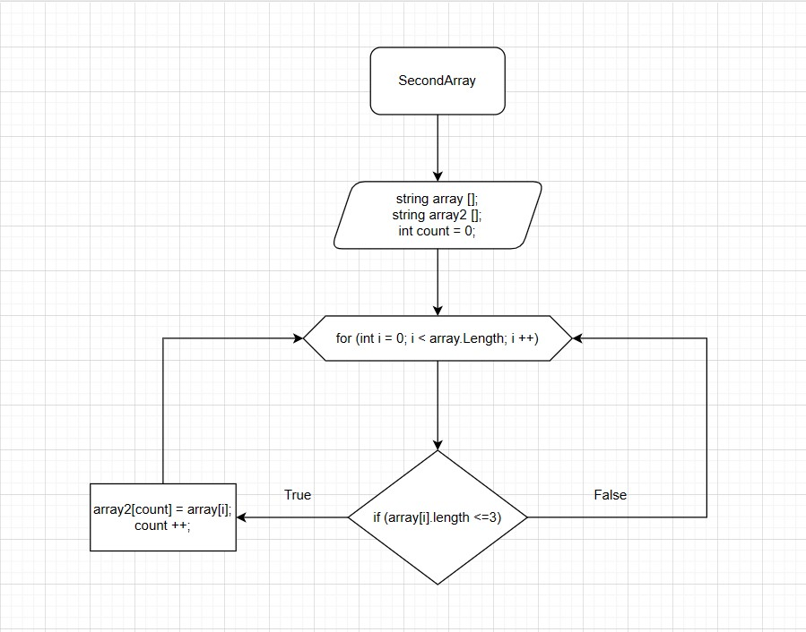

# **Описание решения.**

### InputArray - заполняем масив

### PrintArray - Выводит масив к консоль

### SecondArray - Основное решение

#### **SecondArray** - _Используем метод, в котором цикл соизмерим длине массива, с условием проверки цикла (<= 3), если "True" элемент массива array заносится в count элемента массива array2. Переменная сount увеличивается на 1 и возращается к циклу (for) в котором i увеличивается на 1._

## Схема алгоритма

